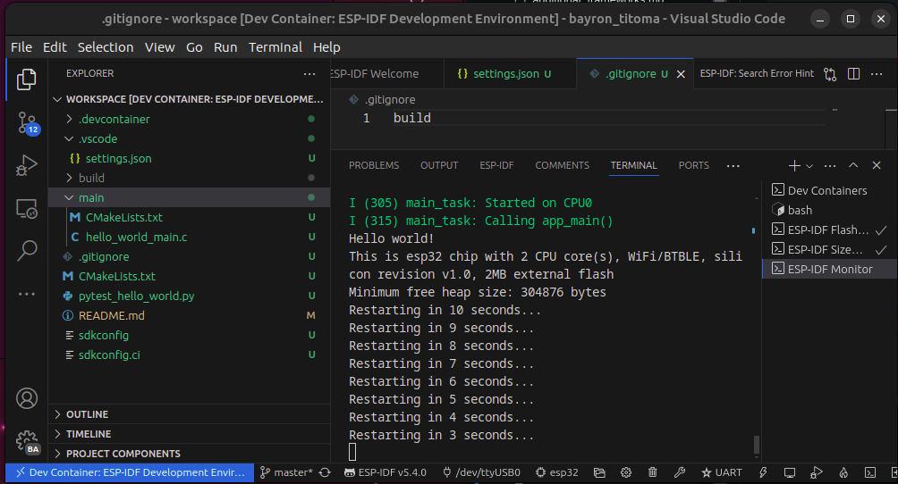

# README.md for ESP32-IDF-Docker-Template

## Overview

This project provides a ready-to-use development environment for the ESP32 using the Espressif IoT Development Framework (ESP-IDF), fully containerized within Docker. The setup is designed to work out-of-the-box with Visual Studio Code, leveraging the Docker Container extension for an integrated development experience. This simplifies the process of setting up and maintaining the development environment, as it abstracts the complexity of configuring and installing the necessary tools directly on your local machine.

## Prerequisites

- Docker installed on your machine.
- Visual Studio Code installed.
- Visual Studio Code Extensions:
  - Remote - Containers extension (`ms-vscode-remote.remote-containers`).

## Getting Started

1. **Clone the Repository**

   ```bash
   git clone https://yourrepository/ESP32-IDF-Docker-Template.git
   cd ESP32-IDF-Docker-Template
   ```

2. **Open with Visual Studio Code**

   Open Visual Studio Code and navigate to `File > Open Folder...`, select the `ESP32-IDF-Docker-Template` directory.

3. **Reopen in Container**

   Using the Remote - Containers extension in VSCode, reopen the project inside the Docker container by clicking on the green bottom-left corner button and selecting `Reopen in Container`. This will build the Docker container based on the provided `Dockerfile` and set up everything needed for the development.

4. **Start Developing**

   Once the container is built and the environment is active, you can start modifying the source files under the `main` directory or create new components as needed.

## Project Structure

- `/.devcontainer`: Contains the `devcontainer.json`, `Dockerfile`, and entry script which configure the development environment.
- `/docs`: Documentation resources like images.
- `/main`: Source directory for your ESP32 application.
- `CMakeLists.txt`: Project-wide CMake configuration file.
- `README.md`: This README file.

## Docker Configuration

The provided Docker configuration sets up the ESP-IDF development environment with all necessary tools. If you need to work with a different version of ESP-IDF or customize the setup:

- **Changing ESP-IDF Version**:
  - Modify the `Dockerfile` to clone a different branch or tag from the ESP-IDF repository. Adjust the `IDF_CLONE_BRANCH_OR_TAG` argument accordingly.
  
    ```Dockerfile
    ARG IDF_CLONE_BRANCH_OR_TAG=release/v4.1  # Change this to the desired version tag
    ```


## Troubleshooting
- **Device Connection Issues**: having `"--privileged"` allows the user to access the USB ports where the ESP32 is connected to directly flash the device.



## Setting Up a New Project Using ESP-IDF Examples

When starting a new project with the ESP32, you can leverage the rich set of examples provided by the ESP-IDF framework. These examples are designed to illustrate various features and capabilities of the ESP32 and can serve as an excellent starting point for your own projects.

### Steps to Initialize a New Project:

1. **Select an Example**:
   - Browse the ESP-IDF examples located at `/opt/esp/idf/examples` within the Docker environment. These examples cover a wide range of applications, from simple tasks like blinking an LED to more complex operations like network communication and sensor integration.

2. **Copy an Example to Your Workspace**:
   - To create a new project, you can copy any of these examples directly into your workspace. This approach ensures that all necessary configurations and boilerplate code are set up correctly. Use the following command in the VSCode terminal to copy an example:

     ```bash
     cp -r /opt/esp/idf/examples/get-started/hello_world/* /workspace/
     ```

   - Replace `get-started/hello_world` with the path to the example you wish to use. This command clones the `hello_world` example into your workspace.

3. **Configure the New Project**:
   - Navigate to the new project directory in your workspace:
   
     ```bash
     cd /workspace
     ```

   - You may need to adjust configuration files such as `sdkconfig` or `CMakeLists.txt` depending on your specific hardware or software requirements.

4. **Build and Run Your Project**:
   - Compile and flash your project to an ESP32 device using the following commands:

     ```bash
     idf.py build
     idf.py -p /dev/ttyUSB0 flash
     ```
   - You Can also perform these steps using the ESP-IDF Extension 
   - Ensure to replace `/dev/ttyUSB0` with the appropriate serial port connected to your ESP32 device.
